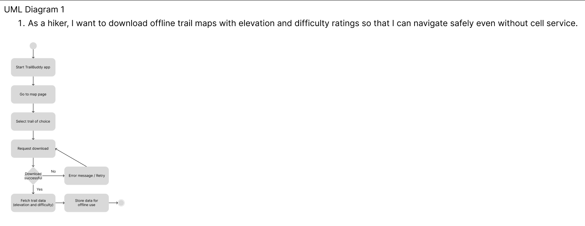

# Specification Phase Exercise

A little exercise to get started with the specification phase of the software development lifecycle. See the [instructions](instructions.md) for more detail.

## Team members

See instructions. Delete this line and replace with a list of the names of your team members, including links to each one's GitHub profile.

Connor Lee (https://github.com/Connorlee487)
Evelynn Mak (https://github.com/evemak)

hello

## Stakeholders

See instructions. Delete this line and replace with the name(s) of the stakeholder(s) you interviewed and lists showing their goals/needs, and problems/frustrations.

## Product Vision Statement

**TrailBuddy empowers every hiker to explore nature safely and confidently by combining intelligent offline navigation, real-time safety features, and community-driven insights in one comprehensive outdoor companion app.**

## User Requirements

1. **As a hiker**, I want to download offline trail maps with elevation and difficulty ratings so that I can navigate safely even without cell service.

2. **As a solo hiker**, I want to automatically share my location with emergency contacts so that my loved ones know where I am if something goes wrong.

3. **As a hiker**, I want to press an "I'm safe" button to ping my emergency contacts so that they know I've completed my hike successfully.

4. **As a hiker**, I want my phone to detect if I fall and send a distress signal when I regain service so that help can find me quickly in an emergency. 

5. **As a hiker**, I want to quickly log my hikes with photos, distance, and elevation so that I can track my progress and remember great trails.

6. **As a hiker**, I want to earn badges for completing different hiking challenges so that I feel motivated to explore more trails and improve my skills.

7. **As a hiker**, I want to share mini trail reports with the community so that other hikers can benefit from my experience and trail conditions.

8. **As a solo hiker**, I want to match with nearby hikers by trail, pace, or skill level so that I can find hiking companions for safety and social connection.

9. **As a hiker**, I want to mark recent wildlife sightings (bears, birds, wildflowers) so that other hikers know what to look for on the same trail.

10. **As a hiker**, I want to see real-time trail conditions (muddy, snow, closures) updated by other users so that I can plan accordingly and avoid dangerous situations.

11. **As a hiker**, I want to see water sources marked on trail maps so that I can plan my hydration and know where to refill my bottles.

12. **As a safety-conscious hiker**, I want to flip on "safety buddy" mode to notify others hiking the same trail so that we can look out for each other without hiking together.

## Activity Diagrams

UML Diagram 1: As a hiker, I want to download offline trail maps with elevation and difficulty ratings so that I can navigate safely even without cell service.

*This activity diagram illustrates the complete user flow for downloading offline trail maps in the TrailBuddy app. The process begins when a hiker opens the app and navigates to the map page, where they can select their desired trail and request a download. The diagram shows the decision point for download success, with error handling that allows users to retry failed downloads. Upon successful download, the system fetches trail data including elevation and difficulty ratings, then stores this information for offline use, ensuring hikers can navigate safely even without cellular service.*

## Wireframe Diagrams

## Clickable Prototype

[Clickable Prototype](https://www.figma.com/proto/WUatCc0R5kj8yIqqZ7ISta/please_join-figma?node-id=120-723&p=f&t=nPdsNznPTUXjmN8E-1&scaling=scale-down&content-scaling=fixed&page-id=106%3A184&starting-point-node-id=120%3A723)
